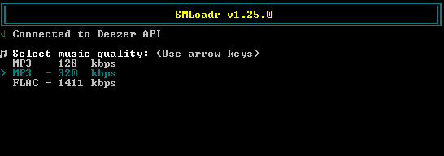
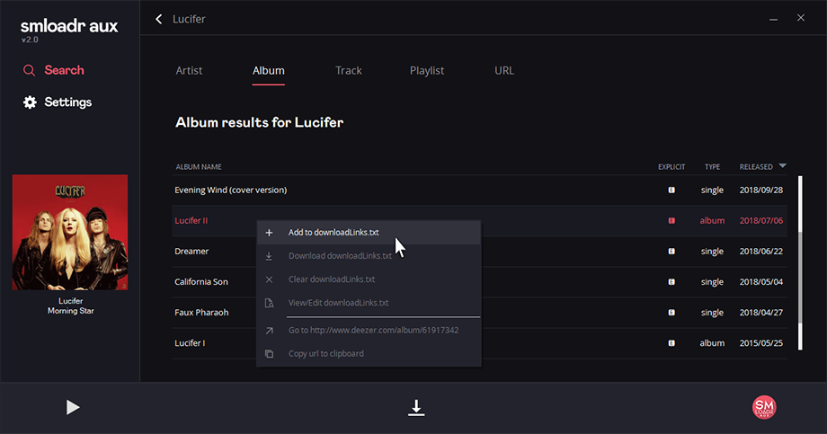

## **SMLoadr**
# **This project is discontinued**

> A streaming music downloader.
It is intended for educational and private use only, and not as a tool for pirating and distributing music!
Remember that the artists and studios put a lot of work into making music - purchase music to support them.





## Features

- Download music in excellent quality for free
- Supports single tracks, albums, artists, playlists and users favourite tracks
- Music quality selection (MP3 - 128 kbps, MP3 - 320 kbps, FLAC - 1411 kbps)
- Auto tagging MP3 & FLAC files (with album cover)
- Saves music to "DOWNLOADS/[artist]/[album]/[track_number] [title].mp3/flac"
- Download a list of links from "downloadLinks.txt"
- CLI support


## Supported platforms

- Windows x64
- Windows x86
- Linux x64
- Linux x86
- MacOS x64
- Android (Run from source, see guide below)
- ARM like Raspberry Pi (Run from source)

## How to use, run and compile

Guide on the [Wiki](https://git.fuwafuwa.moe/SMLoadrDevs/SMLoadr/wiki/How-to-use%2C-run-and-compile)

## How to login with arl cookie

Guide on the [Wiki](https://git.fuwafuwa.moe/SMLoadrDevs/SMLoadr/wiki/How-to-login-via-cookie)

## CLI parameters

| Parameter            | Short               | Default          | Supported values                        | Description                          |
| :-----------------   | :------------------ | :--------------- | :-------------------------------------- | :----------------------------------- |
| ```--quality```      | ```-q```            | ```MP3_320```    | MP3_128/MP3_320/FLAC                    | The quality of the files to download |
| ```--path```         | ```-p```            | ```DOWNLOADS/``` | Path with / in the end                  | Relative path for Downloads folder   |
| ```--url```          | ```-u or nothing``` |                  | album/artist/playlist/profile/track url | Downloads single deezer url          |
| ```--downloadmode``` | ```-d```            | ```single```     | ```all``` for "downloadLinks.txt"       | Downloads multiple urls from list    |
| ```--help```         | ```-h```            |                  | _Nothing_                               | Shows the CLI help                   |


## Downloads

- Get stable release here: [https://git.fuwafuwa.moe/SMLoadrDevs/SMLoadr/releases](https://git.fuwafuwa.moe/SMLoadrDevs/SMLoadr/releases)

## Disclaimer

- We do **not** call to commit crimes.
- The usage of this tool **may be illegal** in your country! Please inform yourself.
- We do **not** give any guarantee at all and we are **not** responsible for damages of all kinds!

#### This work is licensed under a [Creative Commons Attribution-NonCommercial 4.0 International License](http://creativecommons.org/licenses/by-nc/4.0/).
---
> Made with :heart: & :beer: by SMLoadrDevs | Copyright © 2020 SMLoadrDevs.